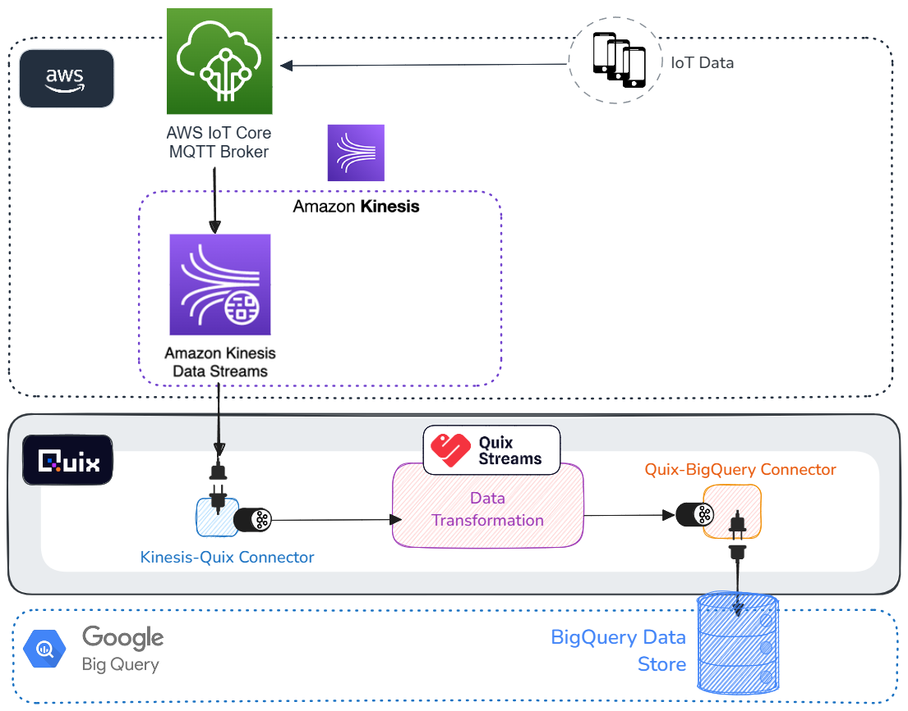

# Quix Data Pipeline: Kinesis to BigQuery

This project is a data pipeline that uses Quix Streams to process data from an AWS Kinesis stream, transform it, and then store it in a Google BigQuery database. It replaces the need to use Kinesis Firehose and S3 in order to get data into Google BigQuery.

Instead of this:

 
You can use Quix to do this:

 

 
This reduces the amount of data transport you have to do in Kinesis and provises a more efficient and cost-effective way to move data from AWS to BigQuery. It is designed to be deployed on the Quix platform, leveraging the platform's capabilities for real-time data processing and integration with cloud services.

## Overview

The pipeline consists of several components:

1. **Publish to Kinesis**: Producer simulated telemetry data.
2. **Localstack Kinesis**: Simulate ingestion of streaming data into AWS.
3. **Kinesis Source**: Read streaming data from AWS into Quix for processing.
4. **Transformation**: Process and transform the data.
5. **BigQuery Sink**: Write transformed data into the data warehouse.

## Component Details

These components are designed to run as distinct services on the Quix platform:

### Publish to Kinesis

- **Purpose**: Publishes hard-coded JSON data to the Kinesis stream.
- **Main Script**: `publish-kinesis/main.py` generates data from a static JSON file and sends it to the Kinesis stream.
- **Dependencies**: Uses `boto3` for AWS SDK interactions.

### Localstack Kinesis

- **Purpose**: Simulates AWS Kinesis locally for development purposes.
- **Dockerfile**: Configures the localstack service to run Kinesis.
- **Environment Variables**: Configures AWS credentials and region.

### Kinesis Source

- **Purpose**: Reads data from the Kinesis Data Stream and publishes it to a Quix topic.
- **Main Script**: `kinesis-source/main.py` initializes a Kinesis source and streams data to Quix.
- **Custom Source**: `kinesis-source/kinesis_source.py` defines the Kinesis source logic.

### Transformation

- **Purpose**: Transforms data from the input topic and publishes it to an output topic.
- **Main Script**: `transformation/main.py` applies a schema transformation to the data.
- **Transformation Logic**: Changes specific fields in the JSON data (e.g., renaming keys).

### BigQuery Sink

- **Purpose**: Inserts transformed data into a BigQuery table.
- **Main Script**: `BigQuery Sink/main.py` configures the BigQuery sink and streams data into BigQuery.
- **Dependencies**: Uses `google-cloud-bigquery` for BigQuery interactions.

## Environment Variables

Each component uses specific environment variables to configure its operation. These include AWS credentials, Kinesis stream names, Quix topic names, and BigQuery configuration details.

## How to Run

1. **Set Up Quix Account**: [Create a Quix account](quix.com) and [set up a project](quix.com/docs).
2. **Deploy Components**: Use the Quix platform to deploy each component as a service.
3. **Configure Environment Variables**: Ensure all required environment variables are set for each service.
4. **Run the Pipeline**: Start the services in the correct order to process data from Kinesis to BigQuery.

## Next Steps

If you want to cut costs further and move away from Kinesis entirely, you can restructure your pipeline to ingest the IoT (or any other data) into Quix directly, process it, and store in BigQuery like so:

S

If you'd like more information, [get in touch](https://share.hsforms.com/1iW0TmZzKQMChk0lxd_tGiw4yjw2).
